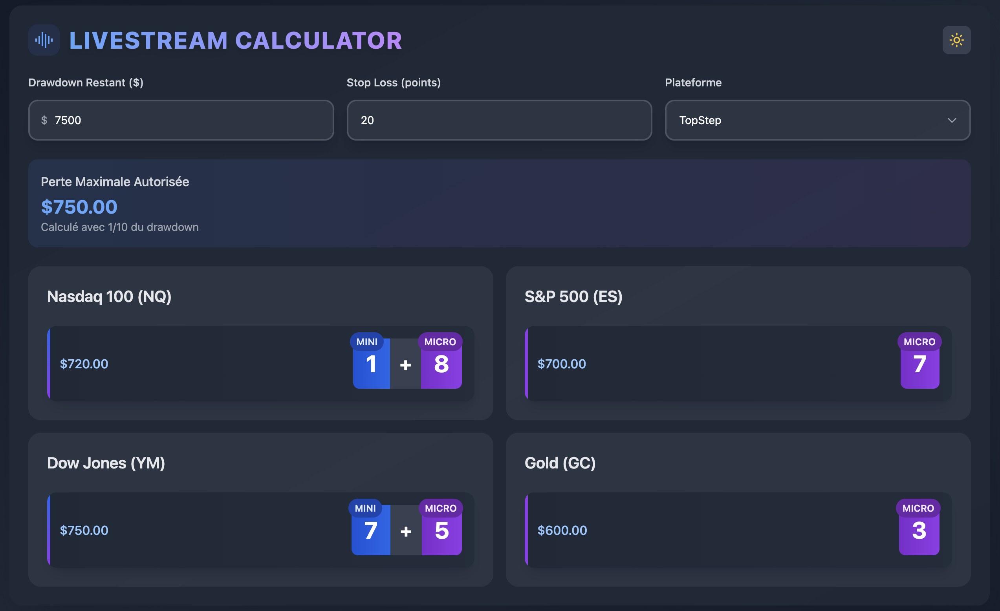
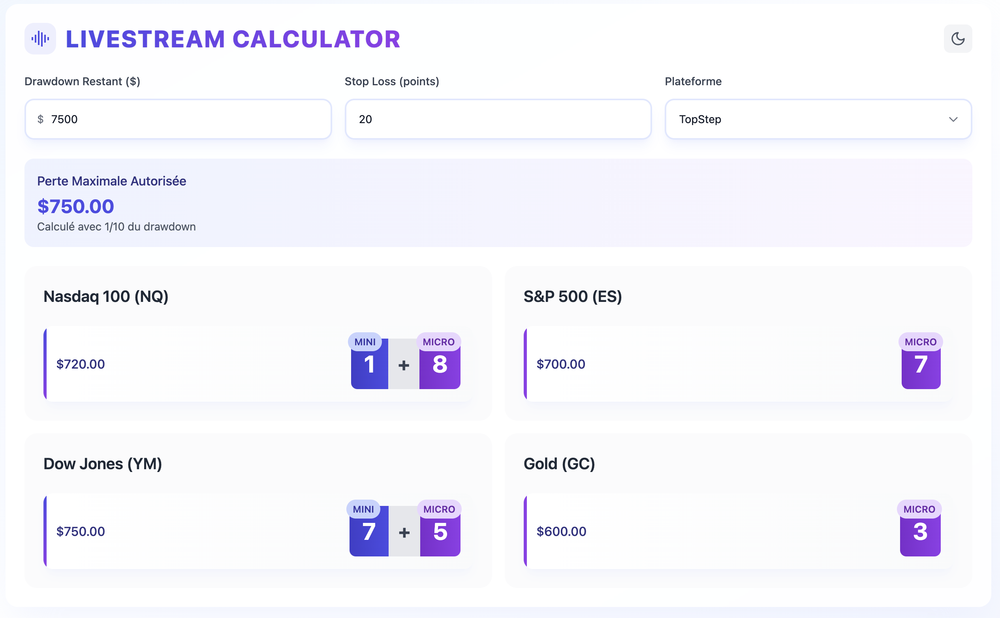

# 📊 Livestream Calculator

A modern, responsive calculator for trading position sizing based on drawdown, stop loss, and platform settings.

[](https://opensource.org/licenses/MIT)
[](https://reactjs.org/)
[](https://www.typescriptlang.org/)
[](https://tailwindcss.com/)
[](https://vitejs.dev/)


## 📱 Overview

The Livestream Calculator helps traders determine the optimal position size for futures contracts based on their current drawdown, stop loss, and trading platform rules. It provides clear recommendations for both mini and micro contracts, helping traders manage their risk effectively.

<div align="center">
  <table>
    <tr>
      <td align="center"></td>
      <td align="center"></td>
    </tr>
    <tr>
      <td align="center"><b>Dark Mode</b></td>
      <td align="center"><b>Light Mode</b></td>
    </tr>
  </table>
</div>

## ✨ Features

- 📈 Calculate maximum position sizes for different futures contracts
- 🏢 Support for multiple trading platforms (TopStep, FTMO, WGF, UFUNDED)
- 🧮 Different calculation methods based on selected platform
- 📱 Mini and Micro contract recommendations
- 🌓 Dark and light mode support
- 🌍 Multilingual support (English and French)
- 💾 Persistent settings via local storage

## 🚀 Usage

1. 💰 Enter your remaining drawdown amount
2. 🛑 Enter your stop loss in points
3. 🔄 Select your trading platform
4. 👁️ View the recommended position sizes for different contracts
5. For each contract, you'll see:
   - 🔢 Maximum number of contracts you can trade
   - 💸 The corresponding maximum potential loss
   - 🔄 Combination of mini and micro contracts when applicable

## ⚙️ How It Works

The calculator determines position sizing using this logic:

1. **Maximum Loss Calculation**:
   - For TopStep, FTMO, and WGF: `maxLoss = drawdown / 10`
   - For UFUNDED: `maxLoss = drawdown / 15`

2. **Position Size Calculation**:
   - `maxContracts = Math.floor(maxLoss / (stopLossPoints * contractTickValue))`

3. **Mini & Micro Optimization**:
   - First fills mini contracts (larger size)
   - If capital remains, adds micro contracts (smaller size)
   - Shows combined view when both are used

4. **Visual Indicators**:
   - 🔵 Blue: Mini contracts
   - 🟣 Purple: Micro contracts
   - Shows clear dollar value of risk taken

This ensures traders can maximize their position size while staying within risk management rules of their chosen platform.

## 🌍 Language Support

The application automatically detects your browser's language settings and displays content in:
- 🇬🇧 English (default)
- 🇫🇷 French

## 🔧 Technical Details

### 🛠️ Technology Stack

- **⚛️ React**: Frontend library
- **📘 TypeScript**: Type-safe JavaScript
- **🎨 TailwindCSS**: Utility-first CSS framework
- **⚡ Vite**: Build tool and development environment

### 🏗️ Architecture

The application follows a modern React architecture with:

- 🧩 Component-based design
- 🔄 React Context API for state management
- 🪝 Custom hooks for business logic
- 🎭 Theme and language contexts for UI preferences
- 📱 Responsive design for mobile and desktop

### 🧩 Key Components

- `useCalculator`: Hook for calculator logic and state
- `ContractCard`: Displays position sizing for each contract
- `ThemeProvider`: Manages dark/light mode
- `LanguageProvider`: Manages language preferences (English/French)
- Utility functions for calculations in `calculatorUtils.ts`

## 💻 Development

### 🚀 Quick Start

```bash
# Clone the repository
git clone https://github.com/nahani/livestream-calculator.git
cd livestream-calculator

# Install dependencies
yarn install

# Start development server
yarn dev
```

Then open your browser to http://localhost:5173

### 📋 Prerequisites

- 📦 Node.js (v14 or higher)
- 🧶 Yarn package manager

### 🔧 Installation

```bash
# Clone the repository
git clone https://github.com/nahani/livestream-calculator.git
cd livestream-calculator

# Install dependencies
yarn install
```

### ⌨️ Development Commands

```bash
# Start development server
yarn dev

# Build for production
yarn build

# Preview production build
yarn preview

# Run linter
yarn lint
```

## 📄 License

This project is licensed under the MIT License - see the [LICENSE](LICENSE) file for details.

## 🙏 Acknowledgments

- 👩‍💻 Created for trading communities
- 📈 Designed to help traders manage risk effectively 