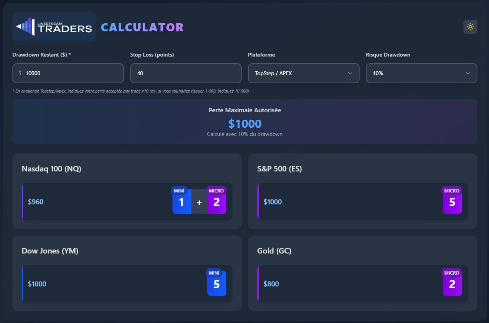
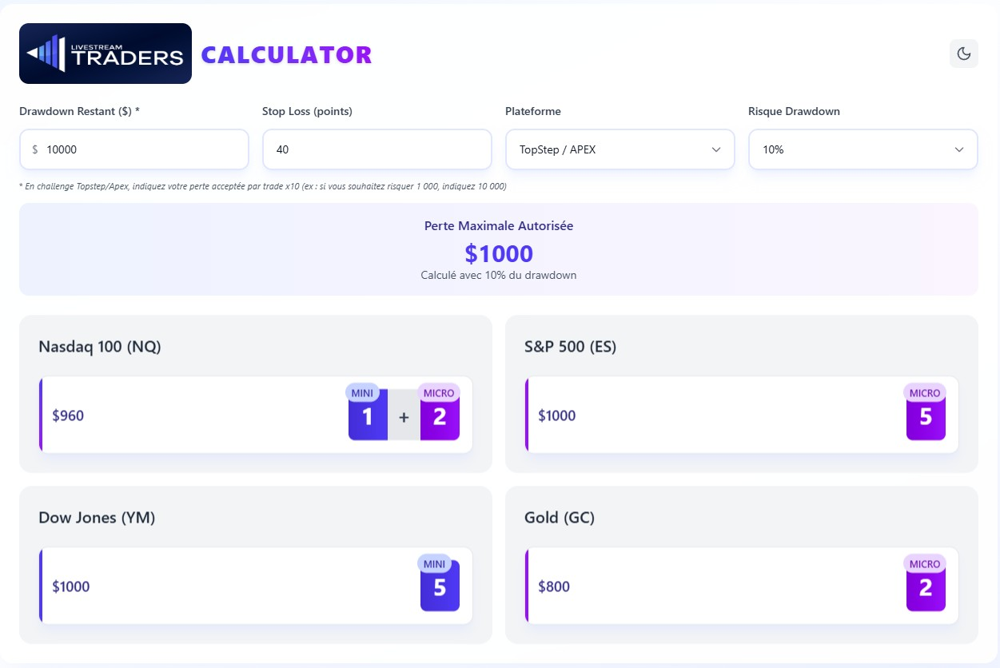

# 📊 Livestream Calculator

A modern, responsive calculator for trading position sizing based on drawdown, stop loss, and platform settings.

[](https://opensource.org/licenses/MIT)
[](https://reactjs.org/)
[](https://www.typescriptlang.org/)
[](https://tailwindcss.com/)
[](https://vitejs.dev/)



## 📱 Overview

The Livestream Calculator helps traders determine the optimal position size for futures contracts based on their current drawdown, stop loss, and trading platform rules. It provides clear recommendations for both mini and micro contracts, helping traders manage their risk effectively.

<div align="center">
  <table>
    <tr>
      <td align="center"></td>
      <td align="center"></td>
    </tr>
    <tr>
      <td align="center"><b>Dark Mode</b></td>
      <td align="center"><b>Light Mode</b></td>
    </tr>
  </table>
</div>

## 🆕 Recent Updates

The calculator now includes several new features to help traders optimize their position sizing:

- **Stock Position Calculator**: New dedicated tab for stock position sizing — enter entry price, stop loss price, and accepted loss to calculate the number of shares and position value.
- **Alternative Position Sizing**: The calculator now shows additional position sizing options that remain within 2% of your maximum allowed loss, giving you more flexibility.
- **Smart Contract Conversion**: When adding a micro contract would result in 10 micros, the calculator automatically suggests converting to an additional mini contract.
- **Risk Warning Indicators**: Visual warning icons appear when a position size exceeds the maximum allowed loss based on your platform's rules.
- **Improved Architecture**: The codebase has been refactored for better maintainability, with clear separation between calculation logic and UI components.
- **SEO Optimizations**: Comprehensive SEO implementation for better discoverability and multi-language support.

## ✨ Features

- 📈 Calculate maximum position sizes for different futures contracts
- 📊 Stock position sizing calculator (shares count + position value)
- 🏢 Support for multiple trading platforms (TopStep, FTMO, WGF, UFUNDED)
- 🧮 Different calculation methods based on selected platform
- 📱 Mini and Micro contract recommendations
- 🔢 Smart conversion of 10 micro contracts to 1 mini contract
- ⚠️ Warning indicators for positions exceeding maximum allowed loss
- 💹 Alternative position sizing suggestions within 2% of maximum allowed loss
- 🌓 Dark and light mode support
- 🌍 Multilingual support (English and French)
- 💾 Persistent settings via local storage
- 📊 Usage analytics with Firebase
- 🔍 SEO optimized with meta tags, structured data, and i18n support

## 🚀 Usage

1. 💰 Enter your remaining drawdown amount
2. 🛑 Enter your stop loss in points
3. 🔄 Select your trading platform
4. 👁️ View the recommended position sizes for different contracts
5. For each contract, you'll see:
   - 🔢 Maximum number of contracts you can trade
   - 💸 The corresponding maximum potential loss
   - 🔄 Combination of mini and micro contracts when applicable

## ⚙️ How It Works

The calculator determines position sizing using this logic:

1. **Maximum Loss Calculation**:
   - For TopStep and APEX: `maxLoss = drawdown / 10`
   - For FTMO/WGF: `maxLoss = drawdown / 10`
   - For UFUNDED: `maxLoss = drawdown / 15`

2. **Position Size Calculation**:
   - `maxContracts = Math.floor(maxLoss / (stopLossPoints * contractTickValue))`

3. **Mini & Micro Optimization**:
   - First fills mini contracts (larger size)
   - If capital remains, adds micro contracts (smaller size)
   - Shows combined view when both are used
   - Automatically converts 10 micro contracts to 1 mini contract

4. **Alternative Position Sizing**:
   - Shows additional options within 2% of maximum allowed loss
   - Displays positions with one additional mini contract (if within limits)
   - Displays positions with one additional micro contract (if within limits)
   - Warning indicators appear for positions exceeding maximum allowed loss

5. **Visual Indicators**:
   - 🔵 Blue: Mini contracts
   - 🟣 Purple: Micro contracts
   - 🟢 Green: CFD lots
   - ⚠️ Yellow warning icon: Exceeds maximum allowed loss
   - Shows clear dollar value of risk taken

This ensures traders can maximize their position size while staying within risk management rules of their chosen platform, with additional flexibility for optimal position sizing.

## 🌍 Language Support

The application automatically detects your browser's language settings and displays content in:
- 🇬🇧 English (default)
- 🇫🇷 French

All UI elements, meta descriptions, and SEO-related content are fully localized for both languages.

## 🔍 SEO Optimizations

The application implements comprehensive SEO optimizations to improve discoverability:

### 📝 Meta Tags & Open Graph
- **Dynamic Meta Tags**: Title, description, and keywords are dynamically generated based on the user's language
- **Open Graph Protocol**: Rich social media previews with custom OG images
- **Twitter Cards**: Support for Twitter's large image summary cards
- **Canonical URLs**: Proper canonical references to prevent duplicate content issues

### 🌐 Internationalization (i18n)
- **hreflang Tags**: Properly configured language alternates
- **Dynamic Content**: All SEO-critical content is available in both English and French
- **Language Detection**: Automatic language detection based on browser preferences

### 📊 Structured Data
- **JSON-LD**: Schema.org structured data for WebApplication type
- **Rich Snippets**: Application details like features, screenshots, and ratings
- **AuthorShip**: Proper attribution with author information and links

### 📱 Progressive Web App (PWA)
- **Web Manifest**: Complete manifest.json for installable PWA functionality
- **Offline Support**: Foundational setup for offline capabilities
- **Mobile Optimization**: Theme color, viewport settings, and Apple-specific meta tags

### 🔄 Technical Optimizations
- **Dynamic Sitemap**: Automatically generated sitemap.xml with proper lastmod dates
- **Robots.txt**: Proper crawler instructions
- **404 Page**: SEO-friendly 404 page with language support
- **Core Web Vitals**: Performance optimizations (preload, preconnect)

These optimizations ensure the application is easily discoverable by search engines, shareable on social media, and provides a great user experience across devices and languages.

## 🔧 Technical Details

### 🛠️ Technology Stack

- **⚛️ React**: Frontend library
- **📘 TypeScript**: Type-safe JavaScript
- **🎨 TailwindCSS**: Utility-first CSS framework
- **⚡ Vite**: Build tool and development environment
- **🔥 Firebase**: Analytics and usage tracking

### 🏗️ Architecture

The application follows a modern React architecture with:

- 🧩 Component-based design with reusable UI components
- 🔄 React Context API for state management
- 🪝 Custom hooks for business logic separation
- 🎭 Theme and language contexts for UI preferences
- 📱 Responsive design for mobile and desktop
- 🧠 Improved separation of concerns with specialized hooks and components

The architecture has been refactored to improve maintainability and scalability:

#### 🪝 Custom Hooks
- `useContractCalculation`: Encapsulates all contract calculation logic
- `useCfdCalculation`: Encapsulates all CFD calculation logic
- `useStockCalculation`: Encapsulates stock position sizing logic

#### 🧩 UI Components
- `ContractOption`: Reusable component for displaying contract options
- `CfdOption`: Reusable component for displaying CFD options
- `StockInputForm` / `StockResult`: Dedicated components for stock calculator
- `ContractCard`: Container component using the specialized hooks and UI components
- `CfdCard`: Container component using the specialized hooks and UI components

This architecture provides:
- 📋 Better separation of concerns
- 🔄 Increased code reusability
- 🧪 Improved testability
- 🧠 Enhanced maintainability

### 🧩 Key Components

- `useContractCalculation`: Hook for contract calculation logic
- `useCfdCalculation`: Hook for CFD calculation logic
- `ContractOption`: Reusable UI component for contract options
- `CfdOption`: Reusable UI component for CFD options
- `ContractCard`: Displays position sizing for each contract
- `CfdCard`: Displays position sizing for CFD
- `ThemeProvider`: Manages dark/light mode
- `LanguageProvider`: Manages language preferences (English/French)
- `calculatorUtils.ts`: Utility functions for calculations
- `analytics.ts`: Firebase Analytics event tracking utilities

## 💻 Development

### 🚀 Quick Start

```bash
# Clone the repository
git clone https://github.com/nahani/livestream-calculator.git
cd livestream-calculator

# Install dependencies
yarn install

# Start development server
yarn dev
```

Then open your browser to http://localhost:5173

### 📋 Prerequisites

- 📦 Node.js (v14 or higher)
- 🧶 Yarn package manager

### 🔧 Installation

```bash
# Clone the repository
git clone https://github.com/nahani/livestream-calculator.git
cd livestream-calculator

# Install dependencies
yarn install
```

### ⌨️ Development Commands

```bash
# Start development server
yarn dev

# Build for production
yarn build

# Preview production build
yarn preview

# Run linter
yarn lint
```

## 📄 License

This project is licensed under the MIT License - see the [LICENSE](LICENSE) file for details.

## 🙏 Acknowledgments

- 👩‍💻 Created for trading communities
- 📈 Designed to help traders manage risk effectively 

## 📊 Analytics Integration

The application includes Firebase Analytics to track usage patterns and improve user experience. The following events are tracked:

### 🔄 Calculation Events
- `calculation_performed`: Tracks calculation details including drawdown, stop loss, and platform
- `platform_changed`: Monitors platform selection changes
- `divisor_changed`: Tracks changes in drawdown divisor settings

### 👥 User Preference Events
- `theme_changed`: Tracks dark/light mode preferences
- `language_changed`: Monitors language selection changes

### 📈 Trading Events
- `contract_viewed`: Tracks which contracts users are viewing and their parameters
- `cfd_calculation`: Monitors CFD-specific calculations

All analytics are privacy-focused and used only to improve the calculator's functionality. No personal information is collected.

### 🔒 Analytics Setup

To enable analytics in your deployment:

1. Create a Firebase project in the [Firebase Console](https://console.firebase.google.com/)
2. Add your web application to get the configuration
3. Create a `.env` file with your Firebase configuration:
   ```env
   VITE_FIREBASE_API_KEY=your_api_key
   VITE_FIREBASE_AUTH_DOMAIN=your_auth_domain
   VITE_FIREBASE_PROJECT_ID=your_project_id
   VITE_FIREBASE_STORAGE_BUCKET=your_storage_bucket
   VITE_FIREBASE_MESSAGING_SENDER_ID=your_sender_id
   VITE_FIREBASE_APP_ID=your_app_id
   VITE_FIREBASE_MEASUREMENT_ID=your_measurement_id
   ``` 